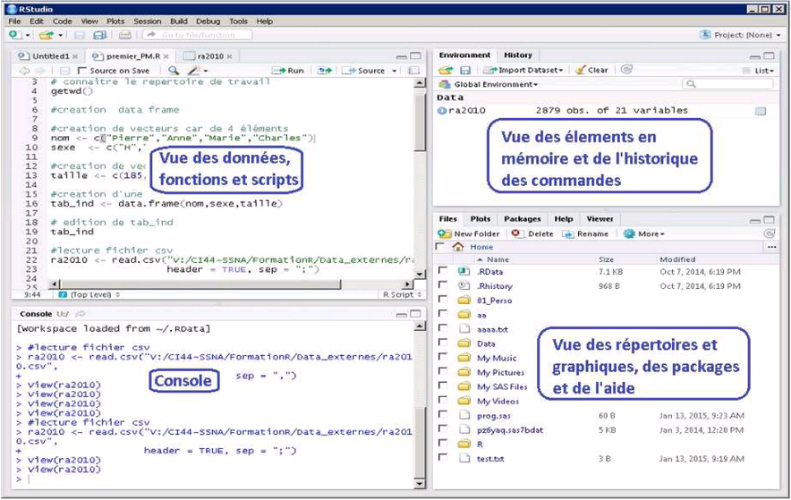

```{r include = TRUE, echo= FALSE, warning = FALSE,message = FALSE}
#setwd("C:/Users/eiq6xm/Documents/Formations/Donnees/R Prise en main rapide/Kit formation R/Diaporama") # espace de travail local
setwd("U:/Mes documents/Kit formation R/Diaporama") # espace de travail sous AUS

# chargement des librairies
install_and_load <- function(P) {
  Pi <- P[!(P %in% installed.packages()[,"Package"])]
  
  if (length(Pi)>0) install.packages(Pi,repos = "http://cran.us.r-project.org")
  for(i in P) library(i,character.only = TRUE)
}

install_and_load(c("tidyverse", "haven", "skimr", "questionr",
                   "readODS", "DT", "knitr", "Hmisc"
                   ))

```

# Sommaire
## Séquencement

- 01 - Présentation de R
- 02 - Prise en main de données
- 03 - Premières statistiques
- 04 - Traitement de données
- 05 - Création de variables
- 06 - Statistiques par modalité
- 07 - Combiner plusieurs tables
- 08 - Stockage de données
- 09 - Réaliser des traitements statistiques
- 10 - Quelques éléments graphiques


# 01 - Présentation de R

## AveRRRrrr...tissement

### R n'est pas un logiciel statistique
#### ... c'est un environnement de programmation
#### ... doté d'un vrai langage de programmaton complet </br>

- scientifique 
- multi-paradigme (plusieurs façons de parvenir à l'objectif)
- programmable

#### ... efficace si on sait l'utiliser </br> </br>

### Ce qui suit est destiné à ceux qui ont autre chose à faire qu'apprendre la programmation !

## Principes généraux

### Une galaxie de 13 000 packages et 220 000 fonctions


## R vs SAS

### Points forts </br>

- Logiciel gratuit et opensource </br>
- Nombreux packages scientifiques </br>
- Rapidité des traitements (usage de la mémoire vive) </br>
- Fonctions graphiques étendues </br>

### Point faibles </br>

- Proche d'un langage informatique </br>
- Problème de compatibilité des versions de R </br>
- Calcul sur des grosses volumétries plus complexe </br>

## Le travail sous R: juste une question de mémoire 

### A l'inverse de SAS, R travaille sur une image des données à traiter chargée en mémoire vive: </br>

- il en découle la rapidité des traitements...
- ... mais la taille de la mémoire devient décisive!

### A l'Insee, trois environnements peuvent être mobilisés

- Le poste de travail individuel, limité en mémoire et en données accessibles
- AUS/LINUX ("Plateforme R"), où la mémoire utilisée s'adapte automatiquement avec une limite de 100GO
- AUS/windows, où on peut manuellement choisir la limite de la mémoire avec une limite de 100GO


## L'interface graphique de RStudio

### Un environnement de développement intégré (EDI)



[Site de RStudio](https://www.rstudio.com/)

## Les 4 fenêtres de RStudio 

<div class="columns-2">
### Source <FONT size="3pt"> (en haut à gauche) </FONT>

- gestion des scripts
- visualisation des données


### Console <FONT size="3pt"> (en bas à gauche) </FONT>

- visualisation de la log (journal d'exécution)
- visualisation des résultats d'exécution
- permet de tester des morceaux de programme


### Environnement <FONT size="3pt"> (en haut à droite) </FONT>

- permet de gérer les objets
- accéder à l'historique d'exécution


### Services <FONT size="3pt"> (en bas à droite) </FONT>

- accès aux fichiers
- visualisation des graphiques
- gestion des packages
- accès à l'aide ! (en anglais)

</div>

## Fenêtre Source 
<div class="columns-2">


</div>

Pour soumettre en exécution une ligne ou un ensemble de lignes sélectionné: Ctrl + Enter

## Fenêtre console de RStudio


- soumettre une commande par **Entrée**
- Aide sur une fonction: **?nom_de_fonction**
- Recherche dans l'aide **??mots-clés**
- Pour effacer le contenu de la console: 
  + menu Edit -> Clear console
  + ou **Ctrl + L**

## Fenêtre Environnement


<div class="columns-2">
Cette fenêtre permet de :

- gérer les éléments en mémoire
- visualiser l'historique des commandes

Avec les icônes, il est possible :

- d'importer des données 
- de sauvegarder des données 
- de vider des éléments en mémoire
</div>

## Fenêtre Services

<div class="columns-2">
<br/>
- Un onglet Files -> accéder à l'arborescence des fichiers <br/>
- Un onglet Help -> accéder à l'aide <br/>
- Un onglet Plots -> visualiser les graphiques <br/>

<br/>
- Un onglet Packages -> gérer (installer/charger) les "paquets" <br/>
</div>

## Répertoire de travail 

### R possède par défaut un répertoire de travail
Sous AUS, ce répertoire est la racine de l'espace personnel (U:/)

### Pour changer le répertoire de travail:
il faut utiliser la commande **setwd("chemin du répertoire souhaité")**

### Pour connaître le répertoire de travail :
il faut utiliser la commande **getwd()**

## Les scripts (ou programmes)

Quand on programme, il est préférable d’écrire les commandes dans la fenêtre de scripts (sources), plutôt que dans la console.

- Ces fichiers, appelés scripts, pourront être sauvegardés, et porteront l’extension <b>.R</b> .
- Pour créer un script : <b>File > New File > R script</b>
- Pour travailler avec un script existant : <b>File > Open File</b>
- Pour sauvegarder un script : <b>File > Save</b> ou <b>File > Save as</b>

## Les scripts (ou programmes)

Pour exécuter des commandes d’un script, on se positionne sur la ligne ou bien on sélectionne l’ensemble des commandes à exécuter puis :

- <b>Code > Run Selected Line(s)</b>, ou
- <b>Ctrl + Enter</b>, ou
- </img>.


Pour interrompre une exécution, on utilise le bouton <b><font color="red">STOP</font></b> de la console :
</img>


# 02 - Prise en main de données

## Chargement de données sous R 

### .rds et .RData sont des formats de stockage natif à R

- plus rapide que des approches non natives
- permet de conserver des informations spécifiques à R (attributs de variables)

### readRDS() permet de lire <u> un seul objet </u> d'extension .rds

- le nom de stockage en mémoire sous R est choisi 

### load() permet de charger <u> un ensemble d'objets </u>, qui porte l'extension .Rdata

- les noms de stockage en mémoire sous R sont ceux présents dans le fichier .Rdata

## Chargement de données sous R

### L'interface de RStudio permet aussi de charger des objets


... mais uniquement d'extension .Rdata

## Quelques règles sous R 

### R est sensible à la casse

### Le nom des objets est assez libre 

- ... mais commence par une lettre
- usage possible des majuscules et minuscules
- usage possible des chiffres et underscore (_)
- il est déconseillé d'utiliser les accents

### Les commentaires s'écrivent après le symbole \#

### Certains noms sont réservés à R (else, for, TRUE, FALSE,...)

### Dans les chemins Windows, les \\ sont remplacés par des /


## Les objets R

R utilise des fonctions ou des opérateurs qui agissent sur des objets (vecteurs, matrices, etc.)

La création d'un objet peut se faire par affectation avec un des trois opérateurs "<-", "->" ou "=".
```{r , echo = TRUE}
a <- 25 # crée l'objet a en lui donnant la valeur 25
x <- a  # x reçoit la valeur a
x = a   # x reçoit la valeur a
a -> x  # x reçoit la valeur a
```

Le symbole # permet d'empêcher l'interprétation d'une partie d'une ligne, et ainsi d'ajouter des commentaires dans un programme.

## Les objets R - Affichage

Si un objet n'existe pas, l'affectation le crée. Sinon, l'affectation écrase la valeur précédente sans message d'avertissement!
On affiche la valeur d'un objet x via la commande :
```{r , echo = TRUE}
print(x)
```
ou encore plus simplement :
```{r , echo = TRUE}
x
```


## Les objets R - Suppression

Par défaut, R conserve en mémoire (vive) tous les objets créés lors de la session. Il est donc recommandé de régulièrement supprimer les objets non (ou plus) nécessaires à la programmation.

Pour connaître les objets de la session il est possible de regarder la fenêtre d'environnement de Rstudio ou bien par la fonction :
```{r , echo = TRUE}
ls()
```
Pour supprimer l'objet a, il suffit de taper :
```{r , echo = TRUE}
rm(a)
```
La preuve :
```{r , echo = TRUE}
ls()
```


## Les objets R - Leurs types

Avant d'aborder les différents objets de R, il faut connaître les principaux modes ou types de ces objets :<br>

- null (objet vide) : <b>NULL</b><br>
- logical (booléen) : <b>TRUE</b>, <b>FALSE</b> ou <b>T</b>, <b>F</b> <br>
- numeric (nombre réel) : <b>1</b>, <b>2.37</b>, <b>pi</b>, <b>1e-10</b><br>
- complex (nombre complexe) : <b>2i</b><br>
- character (chaîne de caractères) : <b>"bonjour!"</b>

Pour connaître l'attribut mode ou type d'un objet x de R, il suffit de taper :
```{r , echo = TRUE}
mode(x)
```

## Les objets R - Tester ou Modifier le mode d'un objet R
<div class="columns-2">
<b>Tester le mode :</b> <br>
is.null(x) <br>
is.logical(x) <br>
is.numeric(x) <br>
is.complex(x) <br>
is.character(x) <br>

<b>Modifier le mode :</b> <br>
as.null(x) <br>
as.logical(x) <br>
as.numeric(x) <br>
as.complex(x) <br>
as.character(x) <br>
</div>
```{r , echo = TRUE}
x <- as.character(x)
is.character(x)
```


## Les vecteurs
Le vecteur est un objet dit atomique de R, c'est-à-dire d'un type unique (null, logique, etc.).
Un vecteur est composé d'un ensemble de valeurs appelées composantes, coordonnées ou éléments.

L'attribut "longueur", obtenu avec la fonction <b>length</b>, donne le nombre d'éléments du vecteur.
```{r , echo = TRUE}
length(x)
```

## Les vecteurs
La fonction <b>is.vector()</b> permet de savoir si un objet est un vecteur :

```{r , echo = TRUE}
is.vector(x)
```

## Les vecteurs numériques
Pour construire un vecteur, il existe différentes méthodes. Par exemple, par la fonction dite collecteur :
```{r , echo = TRUE}
x <- c(2,5.1,-13.7,0.1) # par la fonction c() dite collecteur
x
length(x)
```

## Les vecteurs numériques

Mais également par séquence :
```{r , echo = TRUE, eval = FALSE}
1:6 # par l'opérateur : de séquence
seq(1,6, by=0.5) # par la fonction seq() avec l'argument by
seq(1,6, length=5) # par la fonction seq() de séquence avec l'argument length
rep(1,6) # par la fonction rep() de séquence
```
any() et all()

```{r , echo = TRUE}
x <- c(1,4,6,-4)
any(x > 0)
all(x[1:3]>0)
```

## Les fonctions sur le type numérique

```{r , echo = TRUE}
x <- pi
round(x,2)
floor(x)
ceiling(x)
```
Liste de fonctions mathématiques: "abs", "sign", "sqrt", "trunc", "cummax", "cummin", "cumprod", "cumsum", "log", "log10", "log2", "log1p", "acos", "acosh", "asin", "asinh", "atan", "atanh", "exp", "expm1", "cos", "cosh", "cospi", "sin", "sinh", "sinpi", "tan", "tanh", "tanpi", "gamma", "lgamma", "digamma", "trigamma"

## Le type character
```{r , echo = TRUE}
a <- "Insee"
b <- "Mesurer pour comprendre"
```
Quelques fonctions utiles:
```{r , echo = TRUE, eval = FALSE}
paste0(a,b) # [1] "InseeMesurer pour comprendre"
paste(a,b) # [1] "Insee Mesurer pour comprendre"
paste(a,b,sep=" - ") # [1] Insee - Mesurer pour comprendre
paste0(a,seq(2010,2025,5)) # [1] "Insee2010" "Insee2015" "Insee2020" "Insee2025"
substr(b,2,12) # [1] "esurer pour"
strsplit(b," ") # [1] "Mesurer"    "pour"       "comprendre"
```

## Les vecteurs caractères

Il est possible de créer des vecteurs de caractères de la même façon
```{r , echo = TRUE}
x <- c("A","B","C")
x
```

```{r , echo = TRUE}
x <- rep("A", 5)
x
```


## Sélection d'une partie d'un vecteur

Elle s'opère grâce à l'opérateur [] et un vecteur de sélection :

```{r , echo = TRUE}
x <- c(80,102,127,92,54) # création d'un vecteur x de longueur 5
x[3] # renvoi le 3ème élément de x
x[-c(1,2)] # renvoi x sans les deux premiers éléments

```

## La valeur manquante

Pour différentes raisons, il se peut lors d'une expérience ou d'une enquête que certaines données ne soient pas collectées. R les note <b>NA</b> pour "Not Available".

### Pour tester la présence de valeurs manquantes: *is.na()*
```{r include = TRUE, echo= TRUE, warning = FALSE,message = FALSE}
x<- c(5, NA, 10, 9, NA)
is.na(x)
```

### Dans les calculs, il est possible de les exclure: na.rm = TRUE
```{r include = TRUE, eval= TRUE, warning = FALSE,message = FALSE}
mean(x) # renvoie NA
mean(x, na.rm = TRUE) # renvoie 8
```


## Les facteurs

Les facteurs permettent de manipuler des données qualitatives. Un facteur possède les attributs <b>length</b> et <b>mode</b> mais aussi <b>levels</b> qui renvoit les modalités du facteur.

```{r , echo = TRUE}
Sexe <- factor(c("H","F","F","H","H","F","F","F","H","F"))
levels(Sexe)
```

```{r , echo = TRUE}
table(Sexe)
```


## Les data.frames

Ce sont des listes particulières dont les <u>composantes sont de même longueur</u>, mais de modes qui peuvent être différents.

```{r , echo = TRUE}
C1 <- seq(1,6, length=5)
C2 <- factor(c("A","B","B","A","C"))
DF <- data.frame(C1,C2)
DF
```

## Les data.frames 
### Un data.frame est un tableau de données...
### ...composé de vecteurs...
- vecteur = variable = colonne

### ...qui ont tous le même nombre d'éléments
- nombre d'éléments = nombre d'observations = nombre de lignes

## Les data.frames 

```{r , echo = TRUE}
DF[2,] # renvoie la deuxième ligne du data.frame DF
DF[,1] # renvoie la 1ere colonne du data.frame DF
```

```{r , echo = TRUE}
DF$C1 # renvoie la colonne (variable) nommée C1
DF$C2 # renvoie la colonne (variable) nommée C2
```

## Les data.frames 
### Pour connaître la structure d'un data.frame
```{r , echo = TRUE}
str(DF)
```
### On peut aussi connaître les dimensions de la table par
```{r , echo = TRUE}
dim(DF)
```

## Les data.frames 
### Et les noms des colonnes par
```{r , echo = TRUE}
colnames(DF)
```

### str(), dim(), colnames() sont des fonctions...

```{r , echo = TRUE}
names(DF) <- c("Moyenne", "Type")
str(DF)
```


## Les fonctions 

### R construit autour de ces outils appelés "fonctions" qui:

- réalisent une tâche particulière
- à partir d'informations qu'on leur fournit (arguments)
- et produisent un résultat

### Exemple de la fonction dim()

- tâche: connaître la dimension d'une table de données
- l'argument est la table en question
- le résultat est le nombre de lignes et de colonnes
- <b> Les fonctions sous R ont été nommées par leurs concepteurs... </b>

## L'aide sur les fonctions 

### Dans la console:

- help("nom-fonction")
- ?nom-fonction

### Dans la fenêtre Help de RStudio

<b> On obtient un résultat seulement si le "package" contenant cette fonction est chargé </b>

### Une option de la fonction help()
```{r , echo = TRUE}
#help("dim", try.all.packages = TRUE)
```

## Les packages

Un package (paquet ou bilbiothèque) est un ensemble de programmes R qui permet d'augmenter les fonctionnalités.<br/>

Il existe plus de 200 000 packages. Un certain nombre d'entre eux sont jugés indispensables et sont de fait présents lors de l'installation de R.<br>
Les autres peuvent être téléchargés librement sur le réseau <a href="https://cran.r-project.org/index.html">CRAN</a> (The Comprehensive R Archive Network).<br/>

Pour utiliser un package, il faut qu'il soit installé puis chargé en mémoire.<br>
Cela peut se faire soit par la programmation soit par l'interface utilisateur.

## Les packages - installation

Elle peut se faire de différentes façons:

- par ligne de programme **install.packages("FactoMineR", dependencies = T) ** 
- par le menu <b>Tools > Install Packages...</b> 
- par l'onglet <b>Packages</b> de la fenêtre en bas à droite de Rstudio<br/>


## Les packages - chargement

Une fois installés, les packages doivent être chargés pour être utilisables.<br><br/>

Cela est possible par :

- une ligne de commande <b>library("FactoMineR") </b>
- la fenêtre Rstudio en cochant le package :


## Quelques opérateurs pour info
###Les opérateurs arithmétiques : + - * / ^ <br/>

###Les opérateurs de comparaison

- <b>==</b> pour "égal à" 
- <b>!=</b> pour "différent de" 
- <b>></b> pour "supérieur" 
- <b>>=</b> pour "supérieur ou égal à" 
- <b><</b> pour "inférieur" 
- <b><=</b> pour "inférieur ou égal à" 
- <b>%in%</b> pour "appartenance à un objet" (retourne un booléen)

###Les opérateurs logiques

- <b>!</b> pour la négation _(également la fonction Negate() pour les fonctions)_
- <b>&</b> pour "et" 
- <b>|</b> pour "ou" 


# 03 - Premières statistiques

## Le package dplyr 
### Dans la formation, nous allons utiliser le package dplyr

- **dplyr** est un package développé par RStudio.
- Ce package permet d'utiliser une syntaxe propre à la manipulation de données.


### dplyr

- identifie les principales fonctions nécessaires à la manipulation de données;
- améliore les performances de mise en mémoire des données en utilisant C++; 
- utilise la même interface de travail que les données soient des data-frames ou d'autres types de bases de données 


## Comment installer dplyr ?

**dplyr** est disponible dans le répertoire mis à disposition par l'Insee via RStudio.

La première chose à faire est donc d'installer le package.
```{r include = TRUE, echo= TRUE, eval=FALSE, warning = FALSE,message = FALSE}
install.packages("dplyr")
```

On peut alors le charger :
```{r include = TRUE, echo= TRUE, warning = FALSE,message = FALSE}
library("dplyr")
```

## Enchainer les fonctions: le *Pipe* %>% 
### La syntaxe classique de l'enchainement de fonctions:

- l'ordre chronologique est inversé
- digérer(manger(cuisiner(recette_tajine)))

### La syntaxe de dplyr avec le *Pipe*

- l'ordre chronologique est respecté
- recette_tajine %>% cuisiner %>% manger %>% digérer

<b> Raccourci clavier: Ctrl + Shift + M générère le %>% </b> 

## Premières statistiques: *summarise()* 
```{r include = TRUE, echo= TRUE, warning = FALSE,message = FALSE}
tab_naissances <- readRDS(file = "../RData/naissances2016.rds") # chargement des données

```

#### On souhaite connaître le nombre de lignes de la table:
```{r include = TRUE, echo= TRUE, warning = FALSE,message = FALSE}
tab_naissances %>% summarise(nb_naissances=n())
```
#### On souhaite connaître la moyenne d'age de la mère:
```{r include = TRUE, echo= TRUE, warning = FALSE,message = FALSE}
tab_naissances %>% summarise(age_moyen_mere=mean(agemere))
```

## Premières statistiques: *summarise()* 
### **summarise()** propose un ensemble de statistiques

- nombre, somme: **n()**, **n_distinct()**, **sum()**
- tendance centrale: **mean()**, **median()**
- dispersion: **min()**, **max()**, **quantile()**, **sd()**, **var()**
- position: **first()**, **last()**, **nth()**

## Premières statistiques: distribution 
#### Calculons les quartiles sur la variable *agemere*
```{r include = TRUE, echo= TRUE, warning = FALSE,message = FALSE}
tab_naissances %>% summarise(
  q1_mere = quantile(agemere, 0.25),
  median_mere = quantile(agemere, 0.5),
  q3_mere = quantile(agemere, 0.75)
)
```

#### Et les valeurs extrêmes:
```{r include = TRUE, echo= TRUE, warning = FALSE,message = FALSE}
tab_naissances %>% summarise(min_age_mere = min(agemere),
                             max_age__mere = max(agemere))
```

## Premières statistiques: comptages 
#### Calculons le nombre de naissances multiples, avec la variable *jumeau*:

- jumeau vaut "0" si naissance unique
- jumeau vaut "1" si naissance multiple
```{r include = TRUE, echo= TRUE, warning = FALSE,message = FALSE}
tab_naissances %>% summarise(nb_naissances_multiples = sum(jumeau == "1"))
```

#### R réalise en fait ici la conversion des booléens:

- vrai vaut 1
- faux vaut 0

# 04 - Traitement de données

## Liste de modalités: *distinct()*

```{r include = TRUE, echo= TRUE, eval=FALSE, warning = FALSE,message = FALSE}
tab_naissances %>% distinct(regnais)
```

#### Il s'agit de l'équivalent de la syntaxe SQL 
<pre>select distinct regnais from tab_naissances</pre>


## Extraire des colonnes *select()*

#### Une sélection par les noms
```{r include = TRUE, echo= TRUE, warning = FALSE,message = FALSE}
# une liste de colonnes de notre choix
tab_naissances %>% select(sexe, regnais, agemere, csp) %>% head(3)
```

```{r include = TRUE, echo= TRUE, eval=FALSE, warning = FALSE,message = FALSE}
# toutes les colonnes, réordonnées
tab_naissances %>% select(sexe, regnais, agemere, csp, everything()) %>% head(3)
#supprimer des colonnes
tab_naissances %>% select(-sexe, regnais, agemere, csp, everything()) %>% head(3)
```

- outre everything(), le package **dplyr** continet de nombreuses fonctions utiles: starts_with(), ends_with(), contains(), matches(), num_range(), one_of(), group_cols()


## Extraire des colonnes *select()*

#### Une sélection par les positions
```{r include = TRUE, echo= TRUE, warning = FALSE,message = FALSE}
# une liste de colonnes spécifiées par leur position
tab_naissances %>% select(10,5,42,71) %>% head(2)
```

#### Une sélection par type de colonne avec *select_if*
```{r include = TRUE, echo= TRUE, warning = FALSE,message = FALSE}
# toutes les variables numériques
tab_naissances %>% select_if(is.numeric) %>% head(2)
```

## Renommer des colonnes *rename()*

```{r include = TRUE, echo= TRUE, warning = FALSE,message = FALSE}
# une liste de colonnes spécifiées par leur position
tab_naissances %>% select(sexe , regnais , agemere ,csp) %>% rename(Genre=sexe, region=regnais)
```
**ATTENTION: L'ordre dans rename() est NOUVEAU NOM = ANCIEN NOM**

## Sélectionner des individus *filter()* 

#### On souhaite travailler sur un sous-ensemble:

- les naissances en Nouvelle-Aquitaine (code de région: 75)
- de mères françaises (indicateur de nationalité: 1)

```{r include = TRUE, echo= TRUE, warning = FALSE,message = FALSE}
tab_naissances %>%
  filter(regnais == "75" &
           indnatm == "1") %>%
  summarise(nb_naissances_NA = n()) 
```


# 05 - Création de variables

## Création de variables: *mutate()*
#### On peut créer une variable à partir d'une ou plusieurs autres
```{r include = TRUE, echo= TRUE, warning = FALSE,message = FALSE}
tab_naissances %>% mutate(jumeau2 = as.numeric(jumeau)) %>% 
  select(sexe , regnais , agemere ,csp,jumeau2,jumeau) %>% head(2)
```
#### Ou modifier une variable (en réutilisant le même nom)
```{r include = TRUE, echo= TRUE, warning = FALSE,message = FALSE}
tab_naissances %>% mutate(jumeau = as.numeric(jumeau)) %>% 
  select(sexe , regnais , agemere ,csp,jumeau) %>% head(2)
```

## Création de variables: *mutate()*
#### Il est possible de faire plusieurs opérations dans un appel à *mutate*
```{r include = TRUE, echo= TRUE, warning = FALSE,message = FALSE}
tab_naissances %>% mutate(jumeau2=jumeau, jumeau = as.numeric(jumeau)) %>% 
  select(sexe , regnais , agemere ,csp,jumeau2,jumeau) %>% head(3)
```

## Recoder des variables: *ifelse()*
#### Syntaxe de la fonction ifelse()
<pre> ifelse(condition, valeur_si_vrai, valeur_si_faux) </pre>

```{r include = TRUE, echo= TRUE, warning = FALSE,message = FALSE}
tab_naissances %>% mutate(sexe_ = ifelse(sexe == "1", "garçon", "fille")) %>% 
  select(sexe , regnais , agemere ,csp,sexe_) %>% head(10)
```

## Recoder des variables: *case_when()*
#### Syntaxe de la fonction case_when()
<pre>case_when(condition1 ~ valeur 1,<br/>
    condition2 ~ valeur2, ...<br/>
    TRUE ~ valeur_par_défaut) </pre>

#### Les conditions sont passées en revue jusqu'à donner TRUE

```{r include = TRUE, echo= TRUE, warning = FALSE,message = FALSE}
tab_naissances %>% mutate(sexe_ = case_when(sexe == "1" ~ "garçon", 
                                            sexe == "2" ~ "fille",
                                            TRUE ~ "inconnu")) %>% 
  select(sexe , regnais , agemere ,csp,sexe_) %>% head(5)
```

## Créer une variable sans conserver les autres: *transmute*

```{r include = TRUE, echo= TRUE, warning = FALSE,message = FALSE}
tab_naissances %>% transmute(datenais = paste(jnais,mnais,anais,sep="/")) %>% head(5)
```

# 06 - Statistiques par modalité

## Statistiques par modalités: *group_by()*
```{r include = TRUE, echo= TRUE, warning = FALSE,message = FALSE}
tab_naissances %>% group_by(regnais) %>% 
  summarise( nb_naissances = n(),
             nb_max_enfant_nes_par_accouchement = max(nbenf)) %>% head(10)
```
#### cela ne conserve que les variables ayant servi au regroupement, et les calculs

## Statistiques par croisements: *group_by()*
```{r include = TRUE, echo= TRUE, warning = FALSE,message = FALSE}
tab_naissances %>% group_by(regnais, sexe) %>% 
  summarise( nb_naissances = n(),
             nb_max_enfant_nes_par_accouchement = max(nbenf)) %>% head(10)
```

## Trier: *arrange()*
Le top2 par sexe du nombre de naissance dans chaque région:
```{r include = TRUE, echo= TRUE, warning = FALSE,message = FALSE}
tab_naissances %>% group_by(sexe, regnais) %>% 
  summarise( nb_naissances = n()) %>%
  arrange(sexe,desc(nb_naissances)) %>% top_n(2)
```
Attention, la fonction **head(n)** donne les enregistrements de la table sans groupement
```{r include = TRUE, eval= FALSE, warning = FALSE,message = FALSE}
tab_naissances %>% group_by(sexe, regnais) %>% summarise(nb_naissances = n()) %>% 
  arrange(sexe,desc(nb_naissances)) %>% head(2)
# Sexe            regnais            nb_naissances
# <chr>           <chr>             <int>
# 1	              11	            9393		
# 1	              84	            4818	 
# 2 rows
```
## Dégrouper: *ungroup()*
Ainsi, on récupère le département ayant le plus grand nombre de naissances, dans chaque région:
```{r include = TRUE, echo= TRUE, eval=FALSE, warning = FALSE,message = FALSE}
a <- tab_naissances %>% group_by(regnais, depnais) %>% 
      summarise( nb_naissances = n()) %>%
      filter(nb_naissances == max(nb_naissances))
```

Pour maintenant, ne plus tenir compte du regroupement par région, et ainsi obtenir le département ayant le plus grand nombre de naissances France entière:
```{r include = TRUE, echo= TRUE,eval=FALSE, warning = FALSE,message = FALSE}

a %>% ungroup() %>% 
  filter(nb_naissances == max(nb_naissances))
```

# 07 - Combiner plusieurs tables

## Concaténer deux tables avec dplyr: *bind_rows()*
Il s'agit d'empiler les lignes d'une table derrière les lignes d'une autre.
```{r include = TRUE, echo= TRUE,eval=TRUE, warning = FALSE,message = FALSE}
load(file = "../RData/fillesgarcons.Rdata") #charge deux tables
# colnames(filles)
# colnames(garcons)
ensemble <- filles %>% bind_rows(garcons) # empile les lignes
ensemble
```
Attention aux noms des colonnes... Cela peut générer des valeurs manquantes!

## Coller deux tables avec dplyr: *bind_cols()*
Il s'agit de juxtaposer des colonnes de deux tables dont le nombre de lignes est identique.
```{r include = TRUE, echo= TRUE,eval=TRUE, warning = FALSE,message = FALSE}
vec_alea <- data.frame(alea=runif(nrow(ensemble),1,10)) 
# une table d'une colonne avec autant de nombres aléatoires
# que d'individus dans la table "ensemble"

ensemble2 <-  ensemble %>% bind_cols(vec_alea) # colle les colonnes
ensemble2
```

## Fusionner deux tables avec dplyr 
Il s'agit de contrôler le résultat final... et pour cela nous disposons d'un ensemble de fonctions:


## Fusionner deux tables avec dplyr
```{r include = TRUE, echo= TRUE,eval=TRUE, warning = FALSE,message = FALSE}
personnes <- data.frame(nom = c("Sylvie", "Sylvie", "Monique", "Gunter","Rayan", "Rayan"), 
             voiture = c("Twingo", "Ferrari", "Scenic", "Lada","Twingo","Clio"))
voitures <- data.frame(voiture = c("Twingo", "Ferrari", "Clio", "Lada", "208"), 
            vitesse = c("140", "280", "160", "85", "160"))
```

<div class="columns-2">
```{r}
personnes
voitures
```
</div>

## left_join()
#### on vient enrichir "personnes" par "voitures"
```{r include = TRUE, echo= TRUE,eval=TRUE, warning = FALSE,message = FALSE}
left_join(personnes,voitures,by="voiture")
```
Dans le cas du Scenic, nous n'avions pas de ligne correspondante dans "voitures".

## left_join()
#### on vient enrichir "voitures" par "personnes"
```{r include = TRUE, echo= TRUE,eval=TRUE, warning = FALSE,message = FALSE}
left_join(voitures,personnes,by="voiture")
```
Dans "personnes", aucune personne ne conduit de 208.

## inner_join()
#### on souhaite conserver la partie commune des tables "voitures" et "personnes"
```{r include = TRUE, echo= TRUE,eval=TRUE, warning = FALSE,message = FALSE}
inner_join(voitures,personnes,by="voiture")
```

## full_join()
#### on souhaite conserver l'ensemble des infos des tables "voitures" et "personnes"
```{r include = TRUE, echo= TRUE,eval=TRUE, warning = FALSE,message = FALSE}
full_join(voitures,personnes,by="voiture")
```

## semi_join()
#### on conserve les lignes de "personnes" qui existent dans "voitures"
```{r include = TRUE, echo= TRUE,eval=TRUE, warning = FALSE,message = FALSE}
semi_join(personnes,voitures,by="voiture")
```

## anti_join()
#### on conserve les lignes de "personnes" qui sont absentes dans "voitures"
```{r include = TRUE, echo= TRUE,eval=TRUE, warning = FALSE,message = FALSE}
anti_join(personnes,voitures,by="voiture")
```

## L'importance du by=
### C'est la clé de fusion, et en son absence...
... R cherche les variables communes aux deux tables pour fabriquer une clé de fusion

#### avec une clé différente dans les deux tables
```{r include = TRUE, echo= TRUE,eval=FALSE, warning = FALSE,message = FALSE}
inner_join(df1,df2,by=c("a"="b")) 
# a est une colonne de df1
# b est une colonne de df2
```

#### avec plusieurs clés
```{r include = TRUE, echo= TRUE,eval=FALSE, warning = FALSE,message = FALSE}
inner_join(df1,df2,by=(c("a","c")=c("b","d"))) 
# a et c colonnes de df1
# b et d colonnes de df2
```

# 08 - Stockage de données

## Les fonctions natives de sauvegarde 
### La fonction *save()*
- elle permet de sauvegarder un ou plusieurs objets sous forme d'un seul fichier
- l'extension est .Rdata
```{r include = TRUE, echo= TRUE,eval=FALSE, warning = FALSE,message = FALSE}
save(objet1, objet2,...,file="ensemble.Rdata")
```


### La fonction *saveRDS()*
- elle permet de sauvegarder un seul objet
- l'extension est .rds
```{r include = TRUE, echo= TRUE,eval=FALSE, warning = FALSE,message = FALSE}
saveRDS(objet1, file="objet1.rds")
```

## Importer les types de fichiers courants: Le package *readODS*

- il permet d'importer et d'exporter des fichiers CALC
- le parsing est peu optimisé, il est plus pratique de passer par le format CSV
```{r include = TRUE, echo= TRUE, eval=TRUE, warning = FALSE,message = FALSE}
library(readODS) # read_ODS et write_ODS
data <- read_ods("../Data_nonR/Dep02.ods") #import de fichier CALC
data <- data %>% mutate(densite=Population/Superficie)

write_ods(data, "../Data_nonR/Dep02b.ods")#export de fichier CALC
```

## Importer les types de fichiers courants: Le package *readxl*

- il permet d'importer des fichiers EXCEL
- le parsing est meilleur que celui du package *xlsx* 
- pas de fonction d'export
```{r include = TRUE, echo= TRUE, eval=TRUE, warning = FALSE,message = FALSE}
library("readxl") #read_xls
data <- read_xls("../Data_nonR/cnaf.xls") #import de fichier EXCEL
```

## Importer les types de fichiers courants: Le package *haven*

- il permet d'importer et d'exporter des fichiers SAS
```{r include = TRUE, echo= TRUE, eval=TRUE, warning = FALSE,message = FALSE}
library("haven") #read_sas
data <- read_sas("../Data_nonR/ra2010lib.sas7bdat") #import de fichier SAS
data <- data %>% mutate(chom = chom_hom + chom_fem)

write_sas(data,"../Data_nonR/ra2010lib2.sas7bdat")
```

## Importer les types de fichiers courants: Le package *readr*

- il permet d'importer des fichiers CSV (Comma Separated Values)
- le parsing est meilleur que celui de la fonction RBase 
- privilégier read_csv2 qui est adaptée aux conventions françaises des séparateurs
```{r include = TRUE, echo= TRUE, eval=TRUE, warning = FALSE,message = FALSE}
library("readr") #read_csv2 (préférable à la version de Rbase)
data <- read_csv2("../Data_nonR/dep01.csv")
data <- data %>% 
  mutate(
    partchfem = round(100 * chom_fem / sum(chom_hom+chom_fem, na.rm = T), 1)
    )

write_csv(data, "../Data_nonR/dep01b.csv")
```
```{r include = TRUE, echo= TRUE, eval=FALSE, warning = FALSE,message = FALSE}
# avec du pipe, sans ecrire de variable
read_csv2("./Data_nonR/dep01.csv") %>% 
  mutate(
    partchfem = round(100 * chom_fem / sum(chom_hom+chom_fem, na.rm = T), 1)
  ) %>% 
  write_csv("./Data_nonR/dep01b.csv")
```

## Un package à utiliser: fst 
### 'Lightening Fast Serialization of Data Frames'
- c'est un format efficace pour transmettre une table de données avec des métadonnées
- une vitesse de chargement/déchargement beaucoup plus élevée
- une consommation d'espace disque moindre
- un accès possible à une portion de l'objet sauvegardé (utile pour les grosses bases)

```{r include = TRUE, echo= TRUE,eval=FALSE, warning = FALSE,message = FALSE}
install.packages("fst")
library("fst")
write_fst(objet,"objet.fst")
```

## Un package à utiliser: fst 
### Connaître les métadonnées du fichier

```{r include = TRUE, echo= TRUE,eval=FALSE, warning = FALSE,message = FALSE}
metadata_fst("objet.fst")
```
### Lire une table entière

```{r include = TRUE, echo= TRUE,eval=FALSE, warning = FALSE,message = FALSE}
read_fst("objet.fst")
```

### Lire uniquement certaines lignes

```{r include = TRUE, echo= TRUE,eval=FALSE, warning = FALSE,message = FALSE}
read_fst("objet.fst", from = 1, to=100)
```

### Lire uniquement certaines colonnes

```{r include = TRUE, echo= TRUE,eval=FALSE, warning = FALSE,message = FALSE}
read_fst("objet.fst", columns = c("col1","col2","col12"))
```

# 09 - Réaliser des traitements statistiques

## Le package skimr
```{r include = TRUE, echo= TRUE,eval=FALSE, warning = FALSE,message = FALSE}
install.packages("skimr")
```
```{r include = TRUE, echo= TRUE,eval=TRUE, warning = FALSE,message = FALSE}
library("skimr")
iris %>% skim %>% kable
```

## Le package skimr

```{r include = TRUE, echo= TRUE,eval=TRUE, warning = FALSE,message = FALSE}
iris %>% skim(Sepal.Length) %>% kable # sur une seule variable
```

## Le package skimr
```{r include = TRUE, echo= TRUE,eval=TRUE, warning = FALSE,message = FALSE}
iris %>% group_by(Species) %>% skim() %>% kable # selon des groupes
```

## Le package skimr
Le résultat de la fonction *skim()* est en fait une table, avec des attributs...
```{r include = TRUE, echo= TRUE,eval=TRUE, warning = FALSE,message = FALSE}
iris %>% skim() %>% filter(stat=="mean") %>% arrange(desc(value))
```

## Réaliser un tri à plat
La fonction *table()* donne les effectifs par modalité d'une variable.
```{r include = TRUE, echo= TRUE,eval=TRUE, warning = FALSE,message = FALSE}
ra2010 <- readRDS("../RData/ra2010lib.rds")
effplat <- table(ra2010$dep, useNA="ifany")
effplat
```
La fonction *cumsum()* appliquée à la table des effectifs donne des effectifs cumulés.
```{r include = TRUE, echo= TRUE,eval=TRUE, warning = FALSE,message = FALSE}
somcum <- cumsum(effplat)
somcum
```
## Réaliser un tri à plat
Avec dplyr:
```{r include = TRUE, echo= TRUE,eval=FALSE, warning = FALSE,message = FALSE}
ra2010 %>%  group_by(dep) %>% summarise(nbcom=n()) #Tri à plat
```
```{r include = TRUE, echo= TRUE,eval=TRUE, warning = FALSE,message = FALSE}
ra2010 %>%  group_by(dep) %>% summarise(nbcom=n()) %>% 
  mutate (cumul = cumsum(nbcom)) #Effectifs cummulés en supplément 
```

## Réaliser un tri à plat
Avec dplyr et enjolivé:
```{r,eval=FALSE}
 ra2010 %>%  group_by(dep) %>% summarise(nbcom=n())%>% mutate (cumul = cumsum(nbcom)) %>% 
  knitr::kable(col.names = c("Département","Effectif","Effectifs cumulés "))
```
```{r}
 ra2010 %>%  group_by(dep) %>% summarise(nbcom=n())%>% mutate (cumul = cumsum(nbcom)) %>% 
  knitr::kable(col.names = c("Département","Effectif","Effectifs cumulés "))
```

## Réaliser un tri à plat
La fonction *prop.table()* donne les fréquences à partir de la table des effectifs.
```{r include = TRUE, echo= TRUE,eval=TRUE, warning = FALSE,message = FALSE}
freqplat <- round(prop.table(effplat) *100,2)
freqplat
```
La fonction *addmargins()* permet d'ajouter la marge.
```{r include = TRUE, echo= TRUE,eval=TRUE, warning = FALSE,message = FALSE}
freqplat <- round(addmargins(prop.table(effplat)) *100,2)
freqplat
```
## Réaliser un tri à plat
Avec dplyr et enjolivé:
```{r}
ra2010 %>% group_by(dep) %>% summarise(nbcom=n()) %>% 
  mutate(pour_com = nbcom/ sum(nbcom) * 100) %>% 
  knitr::kable(col.names = c("Département","Effectif","Part en % "))
```

## Réaliser un croisement
La fonction *table()* permet de réaliser un croisement.
```{r include = TRUE, echo= TRUE,eval=TRUE, warning = FALSE,message = FALSE}
effcrois <- table(ra2010$dep, ra2010$categorie_com, useNA="ifany", 
                  dnn = c("Département","Catégorie de commune"))
effcrois
```

## Réaliser un croisement
Avec dplyr:
```{r include = TRUE, echo= TRUE,eval=TRUE, warning = FALSE,message = FALSE}
library(tidyr)
ra2010 %>%  group_by(dep,categorie_com) %>% summarise(nbcom=n()) %>% 
  spread(categorie_com,nbcom)
```

## Réaliser un croisement
La fonction *prop.table()* donne par défaut les fréquences relatives à l'ensemble des effectifs.
```{r include = TRUE, echo= TRUE,eval=TRUE, warning = FALSE,message = FALSE}
freq <- round(prop.table(effcrois,2) *100,2)
freq
```
#### Pour obtenir des fréquences en lignes ou colonnes:
- valeur à 1 pour des fréquences en lignes
- valeur à 2 pour des fréquences en colonnes

## Réaliser un croisement
La fonction *addmargins()* permet d'ajouter des marges au croisement.
```{r include = TRUE, echo= TRUE,eval=TRUE, warning = FALSE,message = FALSE}
freq <- round(addmargins(prop.table(effcrois,2) *100,1),2)
freq
```
#### Pour obtenir des marges soit en lignes soit en colonnes:
- valeur à 2 pour des marges en lignes
- valeur à 1 pour des marges en colonnes

## Les statistiques pondérées *Hmisc*
Voici un jeu d'essai:
<div class="columns-2">
```{r}
poids <- c(1,2,1.5,3,2.5,1,1)
age <- c(20,25,30,35,40,45,50)
DF <- data.frame(poids,age)
```
<br/>
```{r}
DF
```
</div>

```{r include = TRUE, echo= TRUE,eval=TRUE, warning = FALSE,message = FALSE}
library("Hmisc")
DF %>% summarise(quartile1=wtd.quantile(age,w=poids, probs=0.25),
                 mediane=wtd.quantile(age,w=poids, probs=0.5),
                 moyenne=wtd.mean(age,w=poids))
```

# 10 - Quelques éléments graphiques

## script graphique standard

R permet de réaliser un grand nombre de graphiques pouvant être extrêmement élaborés. <br/>
Cette séquence se contente de traiter quelques graphiques communément utilisés. <br/>

**Script standard :**<br/>
`nomGraph(données,main="titre",...arguments du graphique sur les couleurs et les placements des indicateurs)`<br/>
<br/>
La fonction `par()` permet de gérer les très nombreux paramètres graphiques.<br/>
<br/>

```{r include = TRUE, echo= TRUE,eval=TRUE, warning = FALSE,message = FALSE}
library("questionr")
data("hdv2003")
donnee <- hdv2003 # on charge le jeu de donnée fournit par questionr
```

## Histogramme *hist*

```{r include = TRUE, echo= TRUE,eval=TRUE, warning = FALSE,message = FALSE}
hist(donnee$heures.tv, main = "Nombre d'heures passées devant la télé par jour", 
     xlab = "Heures", ylab = "Effectif")
```

## Histogramme *hist*
Nombre de classes choisi

```{r include = TRUE, echo= TRUE,eval=TRUE, warning = FALSE,message = FALSE}
hist(donnee$heures.tv, main = "Heures de télé en 7 classes", breaks = 7, xlab = "Heures", 
  ylab = "Proportion", probability = TRUE, col = "lightblue")
```

## Histogramme *hist*
Classes choisies

```{r include = TRUE, echo= TRUE,eval=TRUE, warning = FALSE,message = FALSE}
hist(donnee$heures.tv, main = "Heures de télé avec classes spécifiées", breaks = c(0, 
  1, 4, 9, 12), xlab = "Heures", ylab = "Proportion", col = "orange")
```

## Boîte à moustaches *boxplot*

```{r include = TRUE, echo= TRUE,eval=TRUE, warning = FALSE,message = FALSE}
boxplot(donnee$heures.tv, main = "Nombre d'heures passées devant la télé par jour",
        ylab = "Heures")
```

## Boîte à moustaches *boxplot*

```{r include = TRUE, echo= TRUE,eval=TRUE, warning = FALSE,message = FALSE}
boxplot(donnee$heures.tv~donnee$occup, main = "Nombre d'heures passées devant la télé par jour",
        ylab = "Heures")
```

## Nuage de points *plot*

```{r include = TRUE, echo= TRUE,eval=TRUE, warning = FALSE,message = FALSE}
plot(donnee$age, donnee$heures.tv, pch = 19, col = rgb(0, 0, 1, 0.1),
     xlab = "Age", ylab = "Heures")
```

## Nuage de points avec une droite de régression
```{r include = TRUE, echo= TRUE,eval=TRUE, warning = FALSE,message = FALSE}
plot(donnee$age, donnee$heures.tv, pch = 19, col = rgb(0, 0, 1, 0.1),
     xlab = "Age", ylab = "Heures")
abline(lm(donnee$heures.tv~donnee$age),col="red")
```

## Sauvegarde d'un graphique

### Via l’interface de RStudio

L’export de graphiques est très facile avec RStudio. Lorsque l’on créé un graphique, ce dernier est affiché sous l’onglet Plots dans le quadrant inférieur droit. Il suffit de cliquer sur Export pour avoir accès à trois options différentes :

- Save as image pour sauvegarder le graphique en tant que fichier image ;
- Save as PDF pour sauvegarder le graphique dans un fichier PDF ;
- Copy to Clipboard pour copier le graphique dans le presse-papier (et pouvoir ainsi le coller ensuite dans un document Word par exemple).

### via un script
```{r eval=FALSE}
boxplot(rnorm(100))
dev.print(device = png, file = "export.png", width = 600)
```

